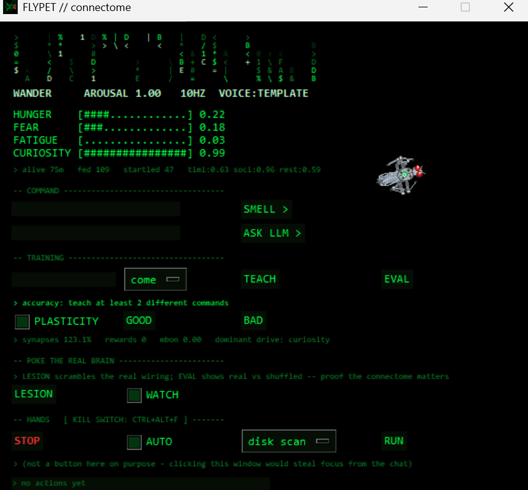

# FlyPet

A **real fruit fly's brain wiring, living on your desktop as a creature.** FlyPet runs the
actual FlyWire FAFB v783 connectome (139,255 neurons, 2.7M synapses, from a real dissected fly,
published in Nature 2024) as a leaky integrate-and-fire network in numpy. You can talk to it,
teach it, feed it, watch its moods — and poke the real brain with genuine neuroscience
experiments.



## What this is (and isn't)

**It is:** a desktop *creature* whose character comes from a real connectome, plus a small
**experiment lab** where you can lesion the wiring, run reward-learning, and prove the real
connectome matters (a control most "connectome pet" demos skip).

**It is not:** an AI that runs your computer, and not sentient. The *reasoning/voice* is a local
LLM; the connectome supplies mood, character, a smell→command classifier, and one real
learning pathway — not rationality. "Hunger", "fear" etc. are honest labels on internal
variables, not feelings.

**What's real vs flavor:** the wiring, the lesion control, and the mushroom-body reward learning
are real and measurable. The drives are simple variables that rise and fall. Both are stated
plainly so you know which is which.

## The LLM is optional

Everything that makes it a creature works **without any AI**: moods, movement, feeding, startle,
sleep, teaching commands, and all the brain experiments run on just Python. A local LLM
(Ollama + `gemma2:2b`) is an *optional* add-on that lets it **talk** and summarize activity.
No Ollama? It still lives, reacts, learns commands, and runs experiments — it just speaks from
templates instead of the LLM. The panel shows `voice: template` when the LLM is absent.

**Safe by default:** on first launch nothing touches your machine — the observer (activity log)
is OFF, autonomy is OFF, and the "hands" (app/keyboard control) do nothing until you ask. Those
are optional power-user layers, not part of the creature.

## Run

**Double-click `FlyPet.lnk`.** No console window — it runs under `pythonw.exe` and shows a
splash while the connectome loads (a few seconds). If a `.lnk` won't run on your system, use
`FlyPet.bat` instead.

To recreate the shortcut and icon (after moving the folder or upgrading Python):

```
python make_app.py              # flypet.ico + FlyPet.lnk here
python make_app.py --desktop    # also put a shortcut on your Desktop
```

Or from a terminal as before: `python fly.py`

Two windows: the fly (transparent, always on top, click-through — clicks go to whatever is
under it) and the **FlyPet** panel. Close the panel to quit; it saves itself.

Tests: `python test_brain.py` (brain) · `python test_learn.py` (learning, ~1 min).

## What it feels

| Your machine | Its neurons | Effect |
|---|---|---|
| cursor within 80 px | `MECH_BRISTLE` (touch) | startles; 3 quick pokes → fear that persists after you leave |
| screen brightness | `VIS_R1R6` (photoreceptors) | dark screen + tired → sleeps |
| CPU load > 60 % / < 15 % | `THERMO_WARM` / `THERMO_COOL` | heavy compile → agitated |
| time since your last input | `DRIVE_HUNGER` | ignored for minutes → hungry, seeks the cursor; rest the cursor on it 1 s → feeds |

Drives: hunger, fear, fatigue, curiosity (bars in the panel).

**Sleep** is homeostatic *and* circadian, like a real fly's: pressure builds while awake and
eventually forces sleep **whatever the screen brightness** — darkness only makes it sleepy
sooner. At full brightness it stays up ~5½ min then naps ~1 min; on a dim screen it naps every
~2 min. Knobs: `FATIGUE_UP/DOWN/IDLE`, `SLEEP_DARK`, `SLEEP_BRIGHT`, `WAKE_AT` at the top of
`fly.py`. Fatigue also drains slowly while merely idle, and the fly rests while the app is
closed, so it never comes back exhausted. Traits (timidity, sociability,
restlessness) are drawn once per fly and saved — two flies behave differently. `memory.json`
keeps drives, traits, lifetime, events; the fly you open tomorrow is the same fly.

Speed and wing-buzz come from the brain (`GNG_DESC` descending-neuron rate). Heading is a
heuristic — this brain-only connectome has no lateralized motor neurons.

## Body

`sprite.py` draws a procedural cyborg fly: chrome plates, red LED eyes, a mood LED on the
thorax, six articulated legs walking in the tripod gait real flies use (legs cycle with
distance walked, so a more aroused fly walks faster), and translucent veined wings folded over
the back. It **flies** — wings spread and blur, legs tuck, a shadow appears — on a startle
escape or when a target is far away, and lands near it or after 6 s. `python sprite.py fly`
shows the pose on its own.

## Observer — it learns what you're doing

The **OBSERVER** panel section lets the fly build background awareness of your activity, which
feeds its LLM reasoning. It is **off by default** and deliberately **not a keylogger**: it
records only which app/window is focused over time and what you copy to the clipboard — never
keystrokes, never password fields, never typed content.

- **WATCH ME** toggles it on. You set a passphrase (used to encrypt the log; it is never stored
  — forget it and the log is unreadable, by design). A red **● REC** indicator appears top-right
  whenever it's recording, so it's never silently on.
- Secret-shaped clipboard strings (API keys, card numbers, long tokens) are redacted *before*
  anything is written. Everything stored is AES-GCM encrypted at rest and auto-deleted after 3
  days (`RETENTION_DAYS` in `observer.py`). Local file only — nothing leaves the machine.
- Every ~10 min the LLM condenses the log into a short "what you've been doing" note. Only that
  note — never the raw log — feeds the fly's reasoning. **WHAT DID YOU LEARN** shows it on demand.
- **WIPE LOG** deletes the encrypted log instantly. `Ctrl+Alt+F` (the kill switch) also stops it.

Needs the `cryptography` package (`pip install cryptography`). If Ollama is down, it keeps
capturing and just leaves the summary stale rather than erroring.

## Hands — it acts on your machine

### Kill switch

**`Ctrl + Alt + F`**, anywhere, any time. Or the red **STOP** button in the panel's *hands* box.
Both freeze every action, kill any running task, release held modifier keys, and switch autonomy
off. Nothing moves again until you press **Resume**.

It also **refuses mouse and keyboard while you're typing** — if your last keystroke was under
2 seconds ago (`hands.TYPING_GUARD`), it waits instead of fighting you for the keyboard.
Every action is logged with a timestamp in the panel.

### What it can do

Type into **Chat (LLM)**: `open notepad`, `run disk scan`, `close browser`, `click 500 300`,
`type hello`, `press ctrl+s`. `gemma2:2b` turns your words into one `ACTION:` line, which
`hands.py` executes. Unknown verbs and off-menu names become `none` — it can't invent an action.

**Long tasks** are the good bit: pick one from the dropdown, press **Run**. The fly enters its
`work` state — sits and buzzes while the job runs in the background — then flies to your cursor
and tells you how long it took.

**A frightened fly refuses.** Fear above 0.6 and it won't act until it calms down. That gate is
the connectome's drives, not decoration.

### apps.json

Edit it to add programs and jobs:

- `apps` — what it can open and close by name
- `tasks` — long background commands
- `autonomous` — the **only** things it may do unprompted

### Autonomy

Off by default; tick **autonomy** in the panel. It then acts on its own only when *all* of:
you've been away 3 minutes, curiosity above 0.7, not afraid, not already busy, and at least
2 minutes since its last urge. It picks from `autonomous` in `apps.json` and nothing else.

### Closing apps — a real caveat

The fly tracks the process IDs of programs it launched, so `close` kills **its** copy, not yours
(verified with a real `.exe`). But Windows 11's **Notepad, Calculator and Paint are Store-app
aliases** — the launcher exits immediately and the real process can't be tracked. For those,
`close` falls back to `taskkill /IM`, which closes **every** instance, including one with your
unsaved work. Normal installed `.exe` apps are tracked properly.

## How to train it

There are three ways to make it act, fastest first:

| Way | Speed | Use it for |
|---|---|---|
| **Type an exact command** in *ASK LLM* | instant | `open notepad`, `run disk scan`, `close browser` — never touches the LLM |
| **Teach it your own phrasing**, then use *SMELL* | ~0.3 s | "can you open calculator" in your words |
| **Chat** in *ASK LLM* | ~11 s | actual conversation ("how are you?") |

**1. Teach commands** — panel *Teach* box: type a phrase, pick a label, press Teach.
~5 wordings per label. The dropdown lists **body behaviours** (`come / sleep / play / stay`)
**and every app and task in `apps.json`** — `open notepad`, `open calculator`, `run disk scan`…
So to train it to open an app: teach 5 phrasings against `open calculator`, then type any
wording into *SMELL* and it opens. Add an app to `apps.json` and it appears in the dropdown. Then type anything in *Command (smell)*: the phrase becomes
an odor (each character bigram drives one glomerulus), the brain runs 20 ticks, a small
mean-centered ridge readout over projection neurons + Kenyon cells decides. Nothing in the
brain changes. Press **Evaluate** for the honesty line:
`real X % · shuffled Y % · chance 25 %` — the middle number is the same test with the wiring
scrambled. Measured: real 62 % / shuffled 46 % on 24 phrases.

**2. Reward / punish** — tick *MB plasticity*, then *Good fly* / *Bad fly* (feeding counts as
Good). This changes real KC→MBON_APP synapse weights (21,438 of them — the fly's learning
site) and fires its dopamine cells. Measured: after 10 rewarded presentations of a smell, the
approach-MBON's response to it rose 1.03 → 1.87; an unrewarded smell 1.12 → 1.26.

**3. New task** — in `learn.py`: `add_task(name, encoder, labels, pop)` with an encoder that
returns a per-neuron input vector (see `smell`, `see`) and a readout population. The shapes
task in `test_learn.py` is the template (16×16 image → photoreceptors via the retina map).

**Not trained:** the LLM. *Chat (LLM)* sends your message plus the fly's live state to
`gemma2:2b` on Ollama (`voice.py`: `BASE_URL`, `MODEL`); it answers in persona and may
end with `ACTION: come|flee|sleep|explore` which the body carries out unless fear vetoes it.
If Ollama is down or out of RAM the fly still speaks from templates (panel shows which).

## Knobs

Top of each file. `brain.GAIN=100` matters most: upstream's normalization leaves the
median neuron with 0.006 total input vs threshold 1.0, so at gain 1 nothing past the
photoreceptors ever fires. `fly.py` intensities and drive rates; `learn.py` `I_SMELL`,
`K_TICKS`, `N_GLOM`.

## Honesty

A connectome is wiring only: no neuromodulators, no per-cell dynamics, weights are synapse
counts. "Emotions" here are persistent internal states with valence that bias behavior —
what real flies demonstrably have — not claims about experience. Every learning number ships
with its scrambled-wiring control; for the toy vision task the control is nearly as good (any
random projection separates shapes), and that's printed rather than hidden.

Data: FlyWire (Dorkenwald et al., Nature 2024) via snedea/flybrain. MIT.
